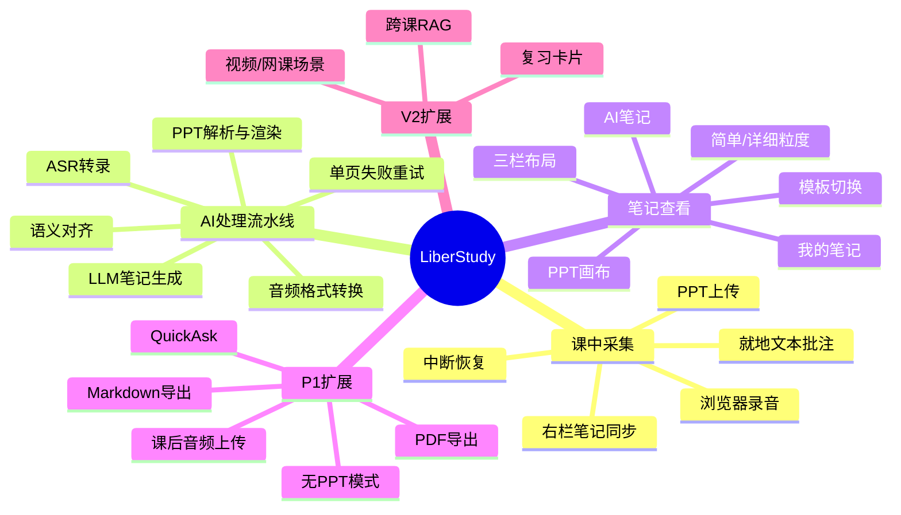
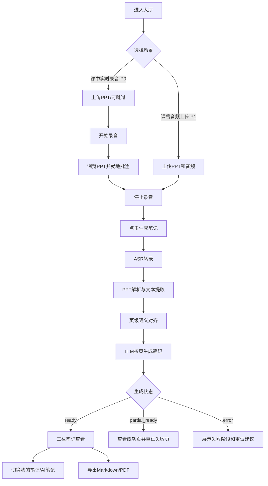
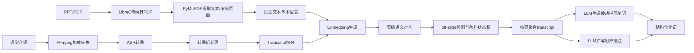

# AIPM 面试拷打题库：LiberStudy 项目

> 用途：把 LiberStudy 从“我 vibe coding 做了一个 demo”转换成“我作为 AI 产品经理做过完整问题定义、方案取舍、AI 能力设计、评估闭环和落地判断”。
>
> 使用方式：先按模块自测。每道题不要只答“做了什么”，必须答清楚“为什么这样做、替代方案是什么、怎么验证、失败怎么办”。

---

## 0. 面试官设定

你面试的是 AIPM 岗位。我不会只问功能，会追问你是否真的做过产品判断。

我重点看 5 件事：

| 维度 | 我会判断什么 | 危险信号 |
|---|---|---|
| 用户洞察 | 你是否知道谁痛、为什么痛、痛到什么程度 | 只说“学生需要 AI 笔记”，没有行为证据 |
| 产品取舍 | 你是否能解释 MVP 为什么做这些、不做那些 | 功能堆叠，P0/P1/V2 说不清 |
| AI 原生 | AI 是否解决核心痛点，而不是包装功能 | 去掉 AI 产品也差不多成立 |
| 评估闭环 | 你是否能定义指标、ground truth、badcase 归因 | “感觉效果还不错” |
| 落地可行性 | 成本、延迟、稳定性、隐私、失败兜底是否想过 | 只会讲 demo，不会讲上线 |

面试回答结构建议：

```text
背景/目标用户 → 痛点证据 → 方案选择 → AI 能力如何绑定痛点 → 关键取舍 → 评估指标 → 当前不足和下一步
```

---

## 1. 项目 2 分钟开场拷打

### Q1：请用 2 分钟介绍 LiberStudy。不能讲技术流水线，先讲产品。

追问：

1. 你的一句话定位是什么？
2. 用户为什么不用飞书妙记、通义听悟、NotebookLM？
3. 这个项目最核心的产品假设是什么？
4. 你怎么证明这不是“录音转文字 + AI 总结”的换皮？
5. 如果我只给你 4 周做 MVP，你砍掉哪些功能？

回答必须包含：

| 要点 | 参考口径 |
|---|---|
| 一句话定位 | 面向 PPT 驱动课堂的知识结构化工具，把课堂音频、PPT 页面和学生批注对齐，生成按 PPT 单页组织的复习笔记 |
| 核心痛点 | 学生课中无法同时捕捉 PPT 视觉信息和老师口头讲解，课后只能低效回看 |
| 核心差异 | 不是全文总结，而是 PPT 页面级锚定 + 语音内容对齐 + 结构化输出 |
| 技术生死线 | ASR 转录、PPT 语义对齐、LLM 笔记生成质量是否足够好 |
| MVP 取舍 | P0 做课中录音、PPT 上传、页级对齐、结构化笔记；Quick Ask、无 PPT、导出作为 P1 或延后 |

危险回答：

- “这是一个 AI 学习助手，可以帮学生生成笔记。”太泛。
- “我用了 ASR、embedding、大模型。”太技术，不像产品经理。
- “功能都挺重要。”说明没有优先级判断。

我的回答：
Ever Stally是一款面向以PPT驱动课堂的AI笔记。他能够将课堂音频PPT页面和随声批注进行对齐，从而生成以PPT单页为组织的结构性笔记产品主要面对的场景是大学生的课前和期末周复习。那在上课期间，学生面临的矛盾点在于认真听讲和做详细笔记。如果选择认真听讲就只能做简单批注而简单批注所带来的后果在于学生没有办法在课后及时回想起当时的讲解过程，从而也失去了批注的意义，增加复习难度和摩擦力。但是如果学生选择非常详细的在课中做笔记，那么他对课堂的知识把握和老师讲解也会失去把握针对课堂中的听课。
那么就是我观察到的痛点，是我的产品，核心理念在于PPT作为锚点AI通过老师讲稿来辅助学生生成结构化的笔记 
具体而言在于随身上课的过程中，它只需要打开never study上传PPT，然后就可以点击录音认真的听讲期间，他也可以做非常简单的批注，而在课后产品会把老师讲的每一句话对应到PPT页面上再结合学生的批注，从而形成非常结构性的笔记。最终两个产品是以PPT作为框架，以老师讲解内容作为这个话比自己的内容填充，并且能够结合学生碎片画的批注，产生完整结构的笔记。

---

## 模块一：用户洞察与问题定义

### 1.1 目标用户：谁来用？

#### Q1：你的核心目标用户是谁？为什么先选这类人？

追问：

1. 你为什么把 985/211 理工科大学生作为 Primary Persona？
2. 文商科学生和理工科学生的痛点有什么差异？
3. 职场会议场景看起来也有价值，为什么不是 MVP 的首选？
4. 你怎么定义早期种子用户？
5. 如果用户画像太宽，你会怎么收窄？

回答必须覆盖：

| 维度 | 小林：理工科大学生 | 小陈：文商科大学生 | Alex：职场人士 |
|---|---|---|---|
| 身份 | 985/211 大三，计算机/电子/自动化 | 大二，经管/法学/新闻 | 互联网/咨询 3-5 年 |
| 课程特征 | PPT 密集，公式、代码、架构图多 | PPT 多为提纲，老师口头案例多 | PPT 驱动会议、培训、评审 |
| 行为特征 | AI 工具接受度高，有考前复习压力 | 常用 Notion/飞书，重视案例和观点 | 会后要纪要和 action items |
| 首选理由 | 频次高、痛点强、PPT 页面锚点价值明显、愿意尝试 AI 工具 | 适合扩展模板，但结构化锚点难度略低 | 商业价值高，但会议权限和数据隐私更复杂 |


核心用户是理科大学生。第二，其次是他们的痛点和强度是最高的，因为理科包括我们上课的课堂批课堂PPT他的特点在于信息密度极高，对于讲解的依赖性技巧主要体现在于PP中含钙大量的公式代码结构图，如果这些脱离了老师的讲解，对于学生的学习成本和复习难度是极高的。成本体现在于，他需要大量资料或者是花费大量时间与对话。复习难度在于心肌密度高需要老师拓展和讲解以及举例才能让学生非常有效地理解这个概念。第三是他们的使用频率高在每学期的专业课，我所了解到是五到八门左右，且每周需要高频的上课，对于我所观察到的场景，他们所面临的时间是上课时间是非常长的，所以产品是具有非常持续使用的价值。最后对于这把我烧药带上来说，他们对于新工具的这种门槛较低，产品的教育成本也较低，并且具备一定的付费能力和意愿。最后。最直接的人在于这部分群体，首先是我能够接触到的最直观的群体调研难度较低。

职场会议场景是属于我的未来规划之一，首先在于它有四个原因地的是目前的竞争格局比较成熟，市面上充斥大量的会议，只要产品包括Granz，为什么要记腾讯会议等等他们在差异化空间上所能够实现的比较少，而且对于PPT的场景依赖较低。其次是会议产品的核心需求是在于决策记录和待办事项的整理，他们对于PPT页面对齐的需求不高，第三是当前顾客成本对我来说是最高的第一次我无法触及到职场核心人群，其次是等启动会比区学生群体要高。

高压追问：

1. 你说学生痛，那是你自己想象，还是做过访谈？
2. 如果只访谈 5 个用户，你怎么保证不是样本偏差？
3. 目标用户愿不愿意上课打开网页录音？这件事本身是不是高门槛？
4. 学生是否真的愿意课中做批注？如果不愿意，你的产品还成立吗？
5. 你选择“课中实时录音”而不是“课后上传音频”，是基于什么用户行为判断？

你需要准备的证据：

| 证据类型 | 最小可准备材料 |
|---|---|
| 定性访谈 | 5-10 个学生，记录当前复习流程、回看时长、笔记方式、工具替代方案 |
| 行为观察 | 课堂中学生是否看 PPT、是否切 tab、是否用手机、是否临时回问“讲到哪了” |
| 案例 | 一节 90 分钟课，用户课后整理用了多久，哪些信息丢失 |
| 竞品替代 | 用户是否用飞书妙记、录音笔、ChatGPT + PDF、NotebookLM |

我的回答：
我在设计产品中面临的一个很大难点在于找到我产品的价值，当我去分析用户没有我这个产品的情况下，如何实现复习路径的时候，通过调查访问和上的需求分析可以得到明确的答复，是他们会将PPT丢给AI，让他们一页一页的讲解，即使AI会存在颗粒度过大讲解过于笼统的问题，学生也能通过非常详细的Printz指令来让实现他们想要的出结果，因为我会思考我的产品的意义是什么，同解是PPT上的内容，我的产品差异化在什么？我对于PPT本身和老师的讲解过程有了更详细的观察来解决这个问题，转变成与其去看当前AI产品能做什么，不如去想AI产品做不到什么AI产品做不到的在于他没有办法去解释PP内容上缺乏的部分，那老师在讲解过程中，无论是针对理科生公式较多推导较多，结构图较多的PPT场景还是针对上课生的案例分析场景，PPT上的内容始终是有限的，而老师拓展出来的内容才是值得关注的东西。因此我去细分了我的产品使用场景，比如针对理工科的专业课老师在讲解过程中存在大量的口头推导板书立体讲解，那么我的产品就能够结合老师的内容进行输出，而这是AI去解释PPT无法做到的。针对于上课上中涉及到案例讲解的场景，老师有大量的口头解释和观点补充，这是AI无法获取到的信息，而是我们产品能够捕捉到的信息，因此我们产品的价值在于老师的独特性，老师讲的越多，那么我的产品就越具有不可替代，这是我对于我的产品目标人群的思考在于光依靠PPT去生成AI讲解是没有办法捕捉到老师在课堂中的补充，把我的产品能够一方面结合PT的框架形成结构化输出，同时也能结合老师的讲解，产生定制化的内容以及学生的自主批注补全整个笔记。

4."批注不是产品的核心依赖。我们有两种笔记模式：一种是被动学习——不需要任何批注，系统自动把全部讲解对齐到 PPT 页面，生成结构化笔记，用户上课全程专心听就行。另一种是主动学习——用户在某页 PPT 上写了批注，AI 基于批注扩写。即便所有用户都不做批注，被动模式依然成立，产品依然有价值。批注是锦上添花，不是地基。"

5."核心差异是行为发生的时机。课后上传需要用户在课结束之后主动做一个额外动作——找到录音文件、打开产品、上传——中间有很多机会放弃。课中录音只需要课前一次触发，之后就自动运行，用户不需要再做决策。我们把认知负担从'课后记得做'变成了'课前设置好'。另外，课中模式还能提供实时字幕辅助，这是课后上传做不到的。但课后上传仍然是 P1 功能——因为它的门槛更低，适合那些已经录了音但没有提前用我们产品的用户，是课中场景的补充入口。"


1.怎么做的需求分析？
第一，数据抓取，第二，数据清洗，第三数据分析，第四，结论验证。
需求分析我做了线下的采访和线上的社区数据挖掘。线下采访中，我的主要目的是为了挖掘用户行为习惯和竞品使用情况。包括上课和复习路径行为复原，对当下语义转录/课堂笔记产品的使用情况和吐槽，最后有对我的产品概念假设即“录音+ppt”对齐有没有想用的渴望、动机和需求。
线上社区数据挖掘中。我选择了小红书和reddit。小红书是因为他是目前国内最贴合学生群体分享、吐槽的社交媒体，活人感比较强，对于新技术和新产品的反应和需求诉求是最真实、样本量最大、最活跃的群体，且符合国内使用场景。而reddit也是国外较为活跃的论坛产品之一，最重要的因素在于他有非常多可以量化的数据指标，比如帖子得分（点赞数量-点踩数量）点赞率（点赞数量/点赞数量+点踩数量）。
那么在研究的过程中我在数据中发现一个反复的模式：用户不缺转录工具，缺的是帮我判断什么是重点。有一个reddit帖子的原话"我在数据里发现了一个反复出现的模式：用户不缺转录工具，缺的是'帮我判断什么是重点'。有一条帖子原话是——'a lot of tools are decent at turning speech into text, but not that helpful when it comes to figuring out what actually mattered. If a professor goes on a tangent for ten minutes, I don't want my notes to treat that the same as an exam concept.'

这条帖子 Score 不高，只有 3 分，但 Upvote Ratio 是 1.0——说明看到的人全部认同，只是曝光量小。我在 15 条以上的帖子里看到了同样的表达模式。

这个发现直接影响了我的产品设计：我们不做通用转录，我们做的是把老师的话对齐到 PPT 页面——因为 PPT 本身就是一个天然的'重点筛选器'，老师在某一页停留越久、说的越多，那一页就越重要。"
"所以我的核心产品假设——'以 PPT 页面为锚点组织笔记'——不是我自己想出来的，是从 400 多条用户原话里提炼出来的。用户的复习行为就是按 PPT 翻页的，我只是把产品形态对齐到了他们已有的心智模型上。"
| 面试官问 | 你怎么答 |
|---|
| "Score 低的帖子能说明问题吗？" | "Score 代表曝光量，Upvote Ratio 代表认同度。Score 3 但 Ratio 1.0 说明所有看到的人都同意，只是帖子没火。我同时看两个指标，不只看 Score。" |
| "200 条帖子够吗？" | "定性研究不追求统计显著性，追求模式饱和。当我在第 150 条之后不再发现新的痛点类型，只是看到重复表达，说明已经饱和了。" |
| "为什么不直接做访谈？" | "社区数据和访谈各有优势。社区数据的好处是零引导偏差——用户是自发表达，不是被我以的问题框架引导的。缺点是无法追问。两者互补，我先用社区数据建立假设，后续再用访谈验证。" |
| "多专家框架是不是过度设计？" | "不是。同一条帖子，JTBD 视角看到的是'用户想完成什么任务'，Kano 视角看到的是'这个需求做不做会不会导致用户流失'。单一视角会遗漏信息。而且多专家框架还有一个工程上的好处——防止单次 AI 调用的 token 超限。" |


产品解决的是以ppt作为课程材料的大学生在课后难以借助零散或者空白的笔记准备重大考试的问题，原来的解决方案是课后花费大量时间重听录音或者将ppt丢给ai一页一页讲解，我提出的新方案则是用户课前点击一下录音，课后直接得到结构化笔记。这个方案从四个维度上进行了优化；一个是时间上，根据社区数据90分钟的课堂需要2-4小时回看和整理，而新方案则是课堂结束自动整理完成，帮助用户缩短了数小时的整理时间；从认知负荷的角度来说，用户在复习过程中需要听录音+翻ppt+做笔记变成只需要做一件事情，即阅读对其好的笔记，从多任务并行降为单任务；从信息完整度的角度来说，从手动记录得到零散的、碎片化的笔记变成全覆盖笔记。从行为门槛上来说，课后要投入大量时间翻阅3个小时的录音转变成，只需要课程中触发一次录音，课后被动获取结果，从主动行为变成了变动行为，大幅度降低用户使用产品的行为负担。核心优化的问题在于，把老师讲的每一句话归位到对应的ppt页面当中。
--------------------------------------------------------------------------------------
"我的产品解决的是理工科大学生课后复习时，老师的口头讲解和 PPT 页面之间对应关系断裂的问题。
用户现在的做法是：课后打开录音和 PPT，手动拖进度条找'这句话对应哪一页'，一门课要花 3-4 个小时。社区数据里 35% 的帖子提到这个时间成本问题，18% 明确说'录音和 PPT 对不上'。

我的方案是：课中自动录音 + ASR 转录 + 语义对齐算法，把每一句话自动归位到对应的 PPT 页面。课后用户直接看按页面组织好的结构化笔记，整理时间从 3-4 小时降到零。

核心优化的不是转录——通义听悟已经做了——而是对齐。目前没有任何竞品做到 PPT 页面级的语义对齐，这是我的差异化。"


#### Q2：你的目标用户有没有明确的“高频刚需”？

追问：

1. 用户是一周用一次，还是考前才用一次？
2. 哪类课程最容易触发使用？
3. 使用频率和课程类型、老师风格、考试方式有什么关系？
4. 如果用户只在期末前使用，你的留存怎么做？
5. 早期你会找哪些课程做验证？

回答要点：

- 高频场景不是“所有学习”，而是 PPT 驱动、信息密度高、老师口头补充多、课后需要复习的课程。
- 第一批最好选理工科专业课、考研/期末强相关课程、课程有统一 PPT 和录音场景。
- 使用频率取决于课程频率，一门课每周 1-2 次，多门课叠加形成周活。

---

### 1.2 用户痛点：为什么用？

#### Q3：用户真实痛点到底是什么？请不要说“记笔记麻烦”。

追问：

1. 痛点发生在课中还是课后？
2. 用户真正付出的成本是什么？
3. “录音转文字”为什么不能解决？
4. “PPT + ChatGPT 总结”为什么不够？
5. 哪些信息在现有流程里丢失了？

回答必须拆成三层：

| 层次 | 痛点 | 说明 |
---|---|---|
| 信息采集层 | 课中同时面对 PPT 视觉流和老师口语流，无法完整记录 | PPT 有公式/图表/关键词，老师讲推导、案例、观点 |
| 结构重建层 | 课后无法知道“老师讲到这一页时说了什么” | 录音是时间流，PPT 是页面结构，二者没有自动关联 |
| 复习效率层 | 只能拖进度条回看，整理成本高 | 90 分钟课可能要 2-4 小时整理 |

关键表达：

> 更上游的问题不是“没有总结”，而是课堂中没有采集到可结构化的复习原料。LiberStudy 要解决的是“音频时间流”和“PPT 空间结构”之间的断裂。

高压追问：

1. 你说 90 分钟课整理 2-4 小时，这个数据从哪来？如果没有调研，你怎么表述才严谨？
2. 用户真的会为节省这 2 小时付费吗？
3. 如果老师本来就发很完整的讲义，你的产品价值还剩多少？
4. 如果课程没有 PPT，产品是否失去核心价值？
5. 如果 ASR 错了、对齐错了，会不会比不用还糟？

可防守回答：

- 当前 2-4 小时可作为痛点假设，需要通过访谈和任务实测验证。
- MVP 不应宣称已经证明，而应说“我的首要验证目标就是证明 PPT 页面锚点笔记能显著降低复习整理时间”。
- 无 PPT 场景可做 P1，但核心差异来自有 PPT 时的多模态对齐。

#### Q4：你怎么证明用户不是“想要更好的总结”，而是“想要页面级结构化笔记”？

追问：

1. 你会设计什么用户实验？
2. 你怎么比较“全文总结”和“PPT 页面级笔记”？
3. 评价指标是什么？
4. 如果实验发现用户更喜欢全文摘要，你怎么办？

建议实验：

| 实验 | 设计 |
|---|---|
| A/B 输出对比 | 同一节课生成 A：全文总结；B：按 PPT 页组织的笔记，让用户完成复习任务 |
| 任务测试 | 让用户回答“老师在某页讲了什么”“某个概念在哪页出现”“考前快速复习哪种更快” |
| 指标 | 任务完成时间、正确率、主观满意度、导出率、二次使用意愿 |
| 决策 | 如果全文摘要更受欢迎，产品定位需转向“快速复习摘要”；如果页面级在定位题和深入复习更强，则保留核心方向 |

---

### 1.3 使用场景：什么时候用？

#### Q5：请描述 2 个具体使用场景，必须有时间、地点、行为、触发点。

场景一：课中实时录音

```text
小林在机器学习课上打开 LiberStudy，上传老师课件并开始录音。老师讲到反向传播公式时，PPT 上只有公式和变量，推导过程在口头讲解里。小林来不及完整记，只在对应位置输入“链式法则这里不懂”。课后系统将录音转录并按 PPT 页对齐，生成该页的公式解释、老师口头推导和小林问题的扩写笔记。
```

场景二：走神后的快速补救

```text
小林上课中途切到其他 tab，回来时不知道老师刚才讲了什么。他点击 Quick Ask 悬浮球或输入“？”，系统基于最近几分钟流式转录缓存回答“刚才主要讲了损失函数从 MSE 切到交叉熵的原因”，帮助他重新接上课堂上下文。
```

高压追问：

1. 为什么 Quick Ask 是 P1，不是 P0？
2. 如果这是高频刚需，为什么 MVP 不先做？
3. 课中录音会不会被麦克风权限、噪音、网络问题影响？
4. 用户在课堂里愿不愿意上传 PPT？如果老师不给 PPT 怎么办？
5. 如果用户忘了打开录音，课后上传能否补救？

产品取舍参考：

- P0 先验证主链路：录音 + PPT + 对齐 + 生成笔记。
- Quick Ask 很有用户价值，但依赖流式 ASR、实时缓存、低延迟问答，工程复杂度更高，可作为 P1。
- 场景①课后上传是补救路径，但不作为核心差异，因为课后上传音频的行为门槛更高。

---

## 模块二：产品方案设计

### 2.1 产品概述

#### Q6：一句话说清楚产品是什么、做什么、怎么做。

你必须准备 3 个版本：

| 场合 | 版本 |
|---|---|
| 10 秒 | LiberStudy 是面向 PPT 课堂的 AI 知识结构化工具，把课堂录音、PPT 页面和学生批注对齐，自动生成按页组织的复习笔记。 |
| 30 秒 | 它解决学生课后只能低效回看录音/视频的问题。用户课中上传 PPT 并录音，可在 PPT 上就地批注；课后系统用 ASR 转录、embedding 对齐和 LLM 生成，把老师口头讲解挂回对应 PPT 页，输出可复习、可导出的结构化笔记。 |
| 2 分钟 | 先讲目标用户和痛点，再讲核心链路，再讲差异化和验证指标。不要一上来讲 API。 |

高压追问：

1. 这个产品第一性原理是什么？
2. 你的输入、处理、输出分别是什么？
3. 产品价值更偏“效率提升”还是“学习效果提升”？
4. 为什么叫知识结构化，而不是总结？

建议回答：

> 第一性原理是把课堂中原本断裂的三类信息重新对齐：PPT 的空间结构、老师讲解的时间流、学生自己的注意力锚点。总结只是输出形式之一，结构化对齐才是核心。

---

### 2.2 核心功能

#### Q7：核心功能有哪些？每个功能解决什么问题？

| 功能 | 用户问题 | 产品决策点 | 优先级 |
|---|---|---|---|
| PPT 上传与解析 | 需要保留页面、图表、术语、结构 | LibreOffice 转 PDF，PyMuPDF 提取文本和渲染 | P0 |
| 课中实时录音 | 课堂信息源来自老师口头讲解 | 浏览器麦克风采集，课后批量 ASR | P0 |
| 就地文本批注 | 用户只来得及记关键词/疑问 | 点击 PPT 任意位置输入，记录页码、时间戳、Y 轴 | P0 |
| ASR 转录与后处理 | 原始录音不可读、不可结构化 | 转为带时间戳 transcript，去口头语、标点重建 | P0 |
| PPT 页级对齐 | transcript 时间流无法对应 PPT 页面 | embedding 相似度 + 用户锚点 + 防抖状态机 | P0 |
| 被动学习笔记 | 用户不记笔记也要有可用产物 | 所有页面生成“PPT + 老师讲解”笔记 | P0 |
| 主动学习扩写 | 用户批注往往是碎片 | 用对应 transcript 扩写用户笔记 | P0 |
| Quick Ask | 课中走神后需要快速接回上下文 | 悬浮球 + 最近 N 分钟 transcript buffer | P1 |
| 导出 | 复习材料要沉淀到个人知识库 | Markdown 优先，PDF 次之 | P1 |

高压追问：

1. 哪个功能是“没有它产品就不成立”的？
2. 哪个功能是“看起来酷但可以延后”的？
3. 为什么就地批注不是语音批注、手写批注、画线批注？
4. 如果用户完全不批注，你的被动学习笔记是否仍然成立？
5. 如果没有 PPT，只做录音笔记，你怎么避免和飞书妙记同质化？

建议立场：

- 核心不可缺：ASR、PPT 解析、页级对齐、被动学习笔记。
- 用户批注是增强信号，不是产品生死线。
- Quick Ask 是强体验点，但不是 MVP 的技术生死线。

---

### 2.3 产品架构/功能图

#### Q8：请画出产品功能架构图。

可用这张图回答：



追问：

1. 这张图里哪个模块最难？
2. 哪些模块是产品体验模块，哪些是 AI 能力模块？
3. 如果只能保留 3 个模块，你保留什么？
4. 哪些模块需要埋点验证？

---

### 2.4 交互流程

#### Q9：用户关键路径是什么？请画流程图。



高压追问：

1. 哪一步最容易流失用户？
2. 处理等待 10 分钟，用户凭什么等？
3. 录音中页面关闭怎么办？
4. 生成失败怎么让用户不崩溃？
5. 三栏布局为什么适合这个产品？

回答要点：

- 流失风险：上传 PPT、麦克风授权、录音后等待生成。
- 兜底：IndexedDB 保存音频 chunks 和笔记；处理页显示阶段进度；失败进入 `partial_ready` 支持单页重试。
- 三栏布局对应用户复习心智：左侧定位页，中心看原始 PPT，右侧看该页笔记。

---

### 2.5 创新与差异化

#### Q10：与现有方案相比，你的方案新在哪里？

追问：

1. 飞书妙记已经能转录和总结，你凭什么说自己差异化？
2. NotebookLM 可以上传材料问答，你有什么不同？
3. 用户把 PPT 和转录稿丢给 ChatGPT，也能总结，你的壁垒在哪里？
4. 差异化是功能差异，还是体验差异，还是数据结构差异？
5. 这个差异会不会很容易被大厂复制？

差异化回答框架：

| 维度 | 传统方案 | LiberStudy |
|---|---|---|
| 信息组织 | 全文转录或全文摘要 | PPT 单页为空间锚点 |
| 输入采集 | 课后上传录音/录屏 | 课中实时录音 + PPT + 批注 |
| AI 处理 | 转录后总结 | ASR + PPT 文本语义对齐 + 按页生成 |
| 用户参与 | 用户手动整理 | 用户批注既是笔记，也是算法锚点 |
| 输出 | 一份线性文档 | 每页 PPT 对应讲解、补充、批注扩写 |

关键表达：

> 我的差异化不是“用了大模型总结”，而是把产品的数据结构设计成“页面级知识单元”。这让后续的复习、检索、RAG、闪卡都能建立在稳定锚点上。

高压追问：

1. 如果飞书妙记明天支持上传 PPT，你怎么办？
2. 页面级对齐是否真的比章节级摘要更好？
3. 你的“用户批注作为锚点”会不会依赖用户配合？
4. 如果用户不喜欢按页复习，而喜欢按知识点复习，怎么办？

可防守思路：

- 页面级是 MVP 的结构锚点，不代表未来只能按页展示；可在页面级数据上再抽象知识点索引。
- 大厂可复制功能，但早期项目可以用更贴近课堂行为的体验和评测数据建立认知优势。

---

## 模块三：AI 原生能力说明

### 3.1 AI 核心能力

#### Q11：产品使用了哪些 AI 能力？每个能力对应什么任务？

| AI 能力 | 任务 | 输入 | 输出 | 关键指标 |
|---|---|---|---|---|
| ASR 语音识别 | 将课堂音频转成带时间戳文本 | WebM/WAV/MP3 | transcript segments | WER、时间戳稳定性、术语识别 |
| 语义 embedding | 把 transcript 片段匹配到 PPT 页 | transcript + PPT page text | page_id / similarity | Page Accuracy、off-slide recall |
| LLM 结构化生成 | 生成按页复习笔记 | PPT 内容 + 对齐 transcript | JSON/Markdown 笔记 | 完整性、准确性、可读性、幻觉率 |
| LLM 扩写 | 扩展用户批注 | 用户 note + 相关 transcript | 主动学习笔记 | 是否保留用户意图、是否补充关键上下文 |
| LLM-as-a-Judge | 辅助评估生成质量 | 生成笔记 + rubric | 质量评分 | 与人工一致性 |
| V2 Agent/RAG | 跨课知识问答 | 当前问题 + 历史 session | 检索增强回答 | 命中率、引用正确性 |

高压追问：

1. 哪个 AI 能力最核心？
2. 哪个能力其实可以不用 AI？
3. 为什么不用端到端多模态大模型直接看 PPT + 听音频？
4. 为什么用 embedding 而不是全交给 LLM？
5. 为什么不用微调？

建议回答：

- 核心不是单个模型，而是 ASR → 对齐 → 生成的链路质量。
- PPT 解析可以用传统工具，不必用 VLM，降低成本和不确定性。
- embedding 适合大规模候选召回，速度快成本低；LLM 适合结构化生成和困难归因。
- MVP 阶段数据量不足，不适合微调；应先用 prompt、结构化输入和评测闭环验证。

---

### 3.2 AI 如何解决痛点

#### Q12：AI 能力和用户痛点的绑定关系是什么？去掉 AI 产品还能成立吗？

| 用户痛点 | 没有 AI 的方案 | AI 的作用 | 去掉 AI 后是否成立 |
|---|---|---|---|
| 录音不可读 | 用户手动听录音整理 | ASR 转为可处理文本 | 基本不成立 |
| 录音和 PPT 无关联 | 用户手动按时间拖动对页 | embedding 自动页级对齐 | 核心差异消失 |
| PPT 缺少老师解释 | 用户凭记忆补充 | LLM 把讲解结构化到对应页 | 价值大幅下降 |
| 用户批注碎片化 | 用户课后自己扩写 | LLM 结合 transcript 扩写 | 仍可记录，但不智能 |
| 走神后接不上 | 问同学或回看 | Quick Ask 总结最近 N 分钟 | 体验点消失 |

关键表达：

> 去掉 AI 后，产品最多是“PPT 查看器 + 录音 + 手动批注”，不能解决自动结构化和对齐问题。因此 AI 不是包装层，而是产品核心生产力。

高压追问：

1. 如果 AI 生成质量只有 70 分，用户会不会完全不信任？
2. 对齐错一页的后果是什么？
3. 你如何降低幻觉？
4. 你如何让用户知道内容来自哪里？
5. 如果 AI 不确定，产品应该怎么展示？

防守策略：

- 输出必须有时间戳引用和页码来源。
- 低置信度对齐要标记，而不是假装确定。
- LLM prompt 限制只使用 PPT 内容和 transcript，不引入外部知识。
- 失败时允许 `partial_ready` 和单页重试，避免整份笔记不可用。

---

### 3.3 AI 技术方案

#### Q13：请讲完整 AI 工作流程。



必须讲清楚的技术取舍：

| 环节 | 选型 | 为什么 |
|---|---|---|
| PPT 解析 | LibreOffice + PyMuPDF | 兼容 PPT/PPTX/PDF，保留页面结构，成本低 |
| 音频转换 | FFmpeg | 浏览器录音格式复杂，统一转 ASR 可接受格式 |
| 中文 ASR | 阿里云 ASR | 中文识别和成本更适合国内课堂 |
| 英文 ASR | Whisper fallback | 英文场景成熟，接入简单 |
| 语义对齐 | text-embedding-3-small | 成本低、速度快、中英文表现可接受 |
| 笔记生成 | Claude/Codex 类长文本模型 | 长上下文、结构化输出稳定 |

高压追问：

1. ASR 错字会怎样影响后面的 embedding？
2. PPT 提取不到文本怎么办？
3. 老师讲代码/黑板/VSCode，和任何 PPT 都不相似怎么办？
4. 老师返回上一页或者跳页怎么办？
5. 多页内容很相似，embedding 怎么区分？
6. 为什么你不做实时 bullet 级高亮？

建议回答：

- ASR 前可注入 PPT 术语表，提高专业词识别。
- PPT 文本缺失时 P1/V2 可用 OCR/VLM 兜底。
- off-slide 内容不强行挂页，归入最近页的 `page_supplement`。
- 页级对齐使用 current_page 状态机和 K=3 防抖，避免一句话误跳页。
- bullet 级实时高亮延迟和准确率风险高，MVP 先做页级对齐和课后生成。

---

### 3.4 评估体系与 Ground Truth

#### Q14：你怎么评估 AI 效果？不能说“人工看了还不错”。

追问：

1. ASR 怎么评估？
2. 对齐怎么评估？
3. 笔记生成怎么评估？
4. LLM Judge 怎么用才可信？
5. badcase 怎么闭环？

最小评测方案：

| 层级 | 数据集 | 指标 |
|---|---|---|
| ASR | 抽样人工校对 transcript | WER、专业术语识别准确率、时间戳偏差 |
| 页级对齐 | 100-300 条 transcript segment 人工标注 gold_page/off_slide | Page Accuracy、Top-k Accuracy、Off-slide Precision/Recall |
| bullet 级对齐 | 20-30 条片段标注对应 bullet | Bullet Accuracy、Adjacent Error Rate、Off-page Error Rate |
| 笔记生成 | 每节课抽 3-5 页做人工 rubric | 完整性、准确性、可读性、学生视角、可溯源性 |
| 用户体验 | 真实用户试用 | 有效消费率、导出率、满意度、笔记放弃率 |

Ground Truth 字段建议：

```json
{
  "segment_id": "seg_001",
  "transcript_text": "这里我们讲一下反向传播的链式法则...",
  "start_time": 123.4,
  "end_time": 129.8,
  "gold_page": 7,
  "gold_bullet": 3,
  "is_off_slide": false,
  "confidence": 0.8,
  "annotation_note": "老师在解释第3条公式推导"
}
```

笔记生成 rubric：

| 维度 | 1 分 | 3 分 | 5 分 |
|---|---|---|---|
| 完整性 | 大量遗漏 | 覆盖主干但缺细节 | 关键点和老师补充都覆盖 |
| 准确性 | 有明显幻觉/错配 | 基本正确但有轻微问题 | 无明显事实错误，页码匹配 |
| 可读性 | 像原始转录，难读 | 有结构但松散 | 适合复习，层次清楚 |
| 学生视角 | 机械复述 | 有少量解释 | 能解释概念、推导、案例 |
| 可溯源性 | 找不到来源 | 部分有时间戳 | 关键内容能回到 PPT/转录/批注 |

LLM-as-a-Judge 正确讲法：

> 我不会直接相信 LLM Judge。先由人工定义 rubric，并抽样做人评；再让 LLM 按同一 rubric 批量评分；最后比较 LLM 评分和人工评分的一致性。一致性不足时，人评为准，LLM 只做辅助筛选。

badcase 分类：

| 类型 | 可能根因 | 处理方向 |
|---|---|---|
| ASR 专业词错 | 术语未注入，模型不熟领域 | PPT 术语表 prompt、术语后处理 |
| 页级误跳 | 某句提到旧页关键词 | K=3 防抖、时间软约束 |
| off-slide 误判 | 口语衔接句语义稀疏 | 前向连贯性升级 |
| 多页相似混淆 | PPT 页面主题接近 | 用户锚点、页内结构、LLM 精排 |
| 生成幻觉 | prompt 不够约束 | 限定来源、引用时间戳、人工抽检 |
| 丢失用户批注 | 批注未进入生成上下文 | note_type、related_segment_ids |

---

## 模块四：加分项

### 4.1 落地可行性

#### Q15：这个产品怎么落地？开发节奏、资源、成本怎么估？

追问：

1. 4 周 MVP 怎么排期？
2. 前后端分别做什么？
3. 单节课成本多少？
4. 90 分钟课多久能处理完？
5. 文件、录音、隐私怎么处理？
6. 如果 API 挂了怎么办？

4 周 MVP 节奏：

| 周期 | 目标 | 验收 |
|---|---|---|
| 第 1 周 | 跑通 PPT 解析、音频上传/录音、ASR | 能得到 PPT 页面文本和带时间戳 transcript |
| 第 2 周 | 跑通页级对齐和基础笔记生成 | 一节测试课生成按页笔记 |
| 第 3 周 | 做三栏查看、批注、模板切换、失败状态 | 用户能完整体验主流程 |
| 第 4 周 | 做评测集、埋点、成本控制、demo polish | 有指标表、badcase、可演示闭环 |

成本口径：

| 项目 | 估算 |
|---|---|
| 90 分钟中文 ASR | 约 ¥5.4，免费额度内为 0 |
| 40 页 PPT LLM 生成 | 约 ¥1.9 |
| 单节中文课总成本 | 免费额度外约 ¥7.3，不含少量带宽和存储 |
| 成本控制 | 每用户每天 2 次，单音频 120 分钟，LLM 并发上限，处理后清理临时文件 |

上线风险和兜底：

| 风险 | 兜底 |
|---|---|
| 麦克风权限拒绝 | 引导上传录音文件 |
| 页面关闭 | IndexedDB 保存音频 chunk 和笔记 |
| ASR 失败 | 标记 error_stage，允许重试 |
| LLM 单页失败 | `partial_ready`，成功页可看，失败页单独重试 |
| 对齐置信度低 | 标记低置信度，不强行展示为确定结论 |
| 隐私风险 | Key 服务端保存，音频/PPT 处理后清理，不用于训练 |

高压追问：

1. 你现在项目里哪些是真实跑通，哪些还是 PRD 规划？
2. 如果面试官现场让你 demo，你展示哪条链路？
3. 你作为 PM 如何管理 vibe coding 产生的代码质量？
4. 你如何证明自己不是只会让 AI 写代码？

建议回答：

- 坦诚区分已实现、mock、规划，不要包装。
- 强调你做的是 specification-driven：PRD、数据结构、流程、指标、测试平台、badcase 记录。
- 代码不是核心卖点，核心是你能把 AI 产品从需求、方案、评估到迭代跑成闭环。

---

### 4.2 商业化思考

#### Q16：这个产品怎么商业化？

追问：

1. 你卖给谁？学生付费能力弱怎么办？
2. 是 ToC、ToB，还是学校采购？
3. 你怎么定价？
4. 竞争优势能不能支撑付费？
5. 你怎么做冷启动？

商业化假设：

| 路径 | 目标客户 | 优点 | 难点 |
|---|---|---|---|
| ToC 学生订阅 | 大学生、考研用户 | 决策快，适合早期验证 | 付费能力弱，获客难 |
| Freemium | 免费 2 节课/月，高频用户付费 | 降低试用门槛 | 成本控制重要 |
| B2B2C 学校/学院 | 高校课程、教务、学习平台 | 规模大，留存强 | 销售周期长，合规复杂 |
| 职场会议版 | 互联网/咨询团队 | 付费能力更强 | 与飞书/钉钉/Zoom 竞争 |

定价思路：

- 免费层：每月 1-2 次生成，验证价值。
- 学生 Pro：按月订阅或按节课计费，限制音频时长。
- 高级功能：跨课 RAG、复习卡片、批量课程知识库、导出模板。
- 职场版：按席位或按会议时长计费，强调纪要和行动项。

高压追问：

1. 学生为什么不用免费工具拼起来？
2. 如果单节成本 7 元，你怎么赚钱？
3. 学生对笔记质量不满意会立刻流失，如何降低试错成本？
4. 学校场景会涉及录音合规，你怎么处理？

防守思路：

- 早期不是先追求大规模商业化，而是验证“页面级结构化笔记”是否有强付费意愿。
- 成本可通过免费额度、批量处理、模型分层、缓存、摘要层级控制降低。
- 合规上需要用户确认录音授权，敏感课程/会议需提示责任边界。

---

## 5. 面试官连续压力测试

### 压力题 A：如果我是面试官，我会这样连续问你

1. 你为什么做这个项目？
2. 这是你自己的需求，还是用户真实需求？
3. 你访谈了多少用户？他们原来怎么解决？
4. 他们最痛的是没笔记，还是没结构，还是没时间？
5. 为什么不是直接用飞书妙记？
6. 为什么 PPT 单页是更好的组织粒度？
7. 你怎么验证“页面级”比“全文总结”更好？
8. 如果用户不上传 PPT 怎么办？
9. 如果用户不批注怎么办？
10. 如果老师不按 PPT 顺序讲怎么办？
11. 如果老师讲到 VSCode/黑板内容怎么办？
12. 如果 ASR 错了怎么办？
13. 如果对齐错了怎么办？
14. 如果 LLM 幻觉怎么办？
15. 你怎么评估生成笔记质量？
16. 你有没有 ground truth？
17. 你为什么选这些模型/API？
18. 为什么不用微调？
19. 为什么不用 RAG？
20. 单节课成本多少？
21. 用户愿意等多久？
22. 你上线后看什么指标？
23. 30 天后如何判断 MVP 成功？
24. 这个项目最大的失败可能是什么？
25. 如果失败，你会怎么调整方向？

### 压力题 B：最容易暴露“vibe coding”的问题

| 面试官问题 | 你不能这样答 | 应该这样答 |
|---|---|---|
| 这个功能为什么做？ | 因为 PRD 里写了/AI 帮我写的 | 来自哪个用户行为观察，解决哪个痛点，为什么排 P0/P1 |
| 这个模型为什么选？ | 因为主流/效果不错 | 任务目标、候选方案、评估维度、成本延迟取舍 |
| 怎么知道效果好？ | 我肉眼看还可以 | ground truth、人评 rubric、LLM judge、线上指标 |
| 失败怎么办？ | 重试一下 | 分阶段失败状态、partial_ready、单页重试、低置信度提示 |
| 你做了什么决策？ | 我实现了很多功能 | 明确讲 3 个关键取舍和背后的依据 |

你必须准备的 5 个个人决策故事：

1. 为什么 MVP 聚焦课中实时录音，而不是先做课后上传？
2. 为什么以 PPT 单页为结构锚点，而不是全文摘要或知识点摘要？
3. 为什么用户批注采用就地文本，而不是复杂手写/画线/语音？
4. 为什么页级对齐先用 embedding + 状态机，而不是端到端 LLM？
5. 为什么 Quick Ask 延后到 P1，尽管它看起来很有吸引力？

每个故事都按这个格式准备：

```text
当时有 A/B/C 三种方案。
我判断核心目标是 X，约束是 Y。
我选择 A，因为它在 MVP 阶段最能验证 Z。
代价是会牺牲 M，所以我用 N 做兜底。
后续通过指标 P 来验证这个决策是否正确。
```

---

## 6. 30/60/90 秒回答模板

### 30 秒版

LiberStudy 是一个面向 PPT 驱动课堂的 AI 知识结构化工具。它解决的是学生课中无法同时记录 PPT 视觉信息和老师口头讲解，课后只能反复回看录音/视频的问题。用户课中上传 PPT 并录音，可在 PPT 上做就地批注；课后系统用 ASR 转录、语义对齐和 LLM 生成，把老师讲解按 PPT 单页组织成结构化复习笔记。核心差异不是“转录总结”，而是页面级锚点和多模态对齐。

### 60 秒版

我的目标用户是 PPT 密集课程里的大学生，尤其是理工科学生。他们的痛点不是没有工具转录，而是录音、PPT 和个人笔记之间没有结构关联，导致课后复习要花很长时间回看和手动整理。LiberStudy 的核心链路是：课中采集音频、PPT 和用户批注；课后通过 ASR 得到带时间戳 transcript，再用 PPT 文本和 transcript 做页级语义对齐，最后由 LLM 生成每页 PPT 对应的老师讲解笔记。MVP 的关键假设是 ASR + 对齐 + 生成的质量是否足够好，所以我设计了 Page Accuracy、off-slide 识别、人工 rubric、满意度和导出率等指标来验证。

### 90 秒版

这个项目我最想展示的是 AI PM 的完整决策链，而不是单纯调 API。用户侧，我把问题定义为“课堂信息流和课后复习结构之间的断裂”：PPT 是空间结构，老师讲解是时间流，学生批注是注意力锚点，现有工具通常只处理其中一个。方案侧，我选择 PPT 单页作为 MVP 的知识单元，因为它和学生复习心智、老师授课结构、后续检索都更匹配。AI 侧，我没有做端到端大模型，而是拆成 ASR、embedding 对齐、LLM 生成三个子任务，分别优化准确率、成本和可控性。评估侧，我会用人工标注集评估页级对齐和 off-slide，用 rubric 和 LLM Judge 评估笔记质量，并用线上有效消费率、导出率、满意度验证真实价值。当前最大风险是对齐和生成质量是否达到用户信任阈值，这也是 MVP 的生死线。

---

## 7. 你现在最需要补的材料

按优先级补齐：

| 优先级 | 材料 | 为什么重要 |
|---|---|---|
| P0 | 5-10 个真实用户访谈记录 | 防止“用户痛点是我想象的” |
| P0 | 1 个完整 demo 链路截图/录屏 | 面试现场可信 |
| P0 | 已实现/未实现/Mock 功能清单 | 避免被追问时包装过度 |
| P0 | 100 条 segment 的页级 ground truth | 证明你懂 AI 评估 |
| P0 | 3-5 个 badcase 复盘 | 展示迭代能力 |
| P1 | 竞品对比截图 | 证明差异化不是口头说 |
| P1 | 成本测算表 | 展示落地意识 |
| P1 | 指标看板设计 | 展示上线后闭环 |

---

## 8. 最后一轮狠问题

如果我只能问 8 个问题，我会问：

1. 你做这个项目之前，如何确认“PPT 页面级结构化笔记”是真需求？
2. 你做过哪些关键产品取舍？请讲一个你主动砍功能的例子。
3. 这个产品里 AI 是核心能力还是效率工具？去掉 AI 会怎样？
4. ASR、对齐、生成三个环节里，哪个最影响用户信任？为什么？
5. 你怎么量化“笔记质量好”？请讲具体指标和评测方法。
6. 你最大的 badcase 是什么？你怎么定位根因？
7. 如果 MVP 上线后用户生成了笔记但不打开看，你怎么分析？
8. 如果让你重做一遍，你最先验证什么，而不是最先开发什么？

最佳结尾表达：

> 这个项目对我最大的价值不是做出了多少功能，而是让我意识到 AI 产品经理不能只把大模型接进流程里。真正关键的是定义清楚任务边界、数据结构、评估标准和失败兜底。LiberStudy 的核心就是把课堂的时间流和 PPT 的空间结构对齐，这个判断能否成立，需要用真实用户和评测闭环持续验证。

